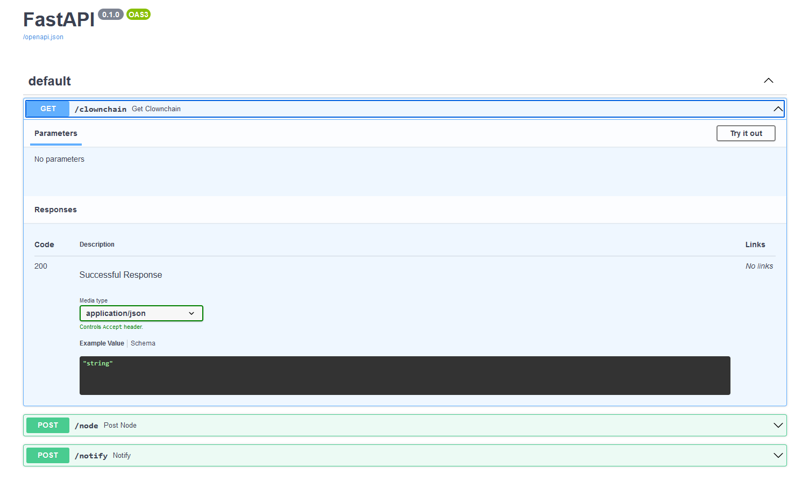
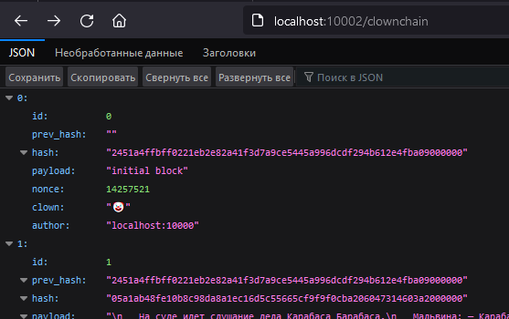

# Cl🤡wnch🤡in

## main 

## develop 
## 🤡-🤡-🤡-🤡-🤡-🤡-🤡-🤡-🤡-🤡-🤡-🤡


# Как запустить

```bash
docker-compose build
docker-compose up
```


Предусмотрен swagger интерфейс для ручной проверки

`http://localhost:10002/docs`



За кринжовые шутки приношу извинение

