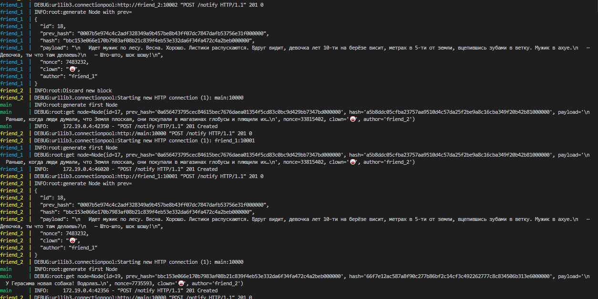

# Cl🤡wnch🤡in

## 🤡-🤡-🤡-🤡-🤡-🤡-🤡-🤡-🤡-🤡-🤡-🤡


# Как запустить

```bash
docker-compose build
docker-compose up
```



Предусмотрен swagger интерфейс для ручной проверки

`http://localhost:10002/docs`


За кринжовые шутки приношу извинение

